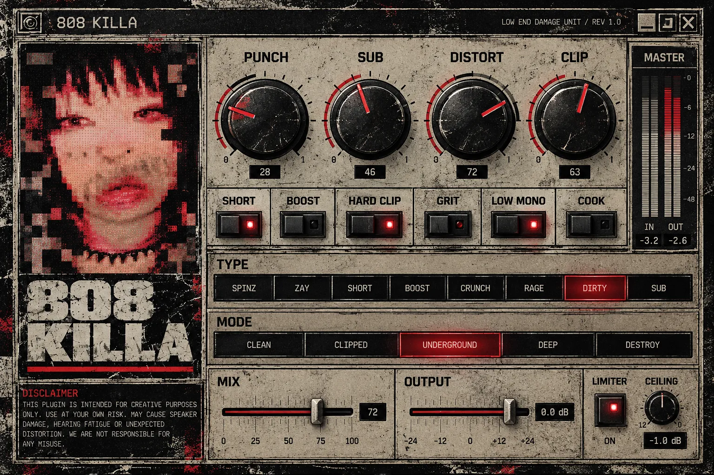

# 808 KILLA – Low End Damage Unit

Audio efekt pro 808 (VST3 pro Windows a Mac, AU pro Logic). Vložíš ho na mixer insert s 808,
vybereš styl, otočíš KILL a pár maker – hotovo. Plugin nemá sampler, zpracovává jen audio, které do něj přijde.

## Stažení hotového pluginu

GitHub ho sestaví sám po každé změně:

1. Záložka **Actions** → poslední běh **Build 808 KILLA** se zelenou fajfkou.
2. Dole v **Artifacts** stáhni:
   - **808-KILLA-Installer-Windows** – instalátor (.exe), nainstaluje VST3 do `C:\Program Files\Common Files\VST3`
   - nebo **808-KILLA-VST3-Windows** – samotná složka `808 KILLA.vst3` na ruční zkopírování
   - **808-KILLA-Installer-macOS** – instalátor (.pkg) pro Mac (VST3 + AU)
3. Ve FL Studiu: *Options → Manage plugins → Find more plugins*.

## Co umí (verze 0.4)

**SIMPLE stránka:** výběr stylu/presetu (◀ ▶), velký **KILL** a makra **LENGTH, PUNCH, SUB, DIRT, BEND, WOBBLE**,
ladička (nota + tónina), MASTER metr (peak + LUFS short-term), **PHONE CHECK** a **A/B** porovnání.

**ADVANCED stránka (záložky):**

| Záložka | Parametry |
|---|---|
| PITCH | Knock (pitch úder), Bend (trap dive) + čas a zpoždění, Octave Down, Octave Up |
| WOBBLE | LFO na pitch / hlasitost / filtr, sync s tempem (1/2 až 1/32, T, D), 5 tvarů, fade-in, retrigger |
| CHOP | Rytmické sekání synchronizované s tempem: 1/8, 1/16, 1/16T, 1/32, Roll, Gross, Stutter; Depth, Gate, Smooth |
| SHAPE | Punch, Click, Length (zkrácení i prodloužení dozvuku) |
| TONE | Sub, Harmonics, Tilt, Filter (LP 12/24 dB, cutoff, resonance) |
| DIRT | Soft / Hard Clip / Tape / Tube / Foldback / Bitcrush, Drive, Mix, Crush, Post filter, Clean Low, Auto gain, Oversampling 2×/4×/8× |
| DUCK | Kick duck přes sidechain: Amount, Release, Shape |
| OUTPUT | Input, Clipper, Ceiling, Mono below, Width, Output, Dry/Wet |
| SETTINGS | verze, složka presetů |

**Styly:** Atlanta Clean, Memphis Phonk, Rage Underground, Detroit Clip, Drill Chicago, Drill NY, Drill UK,
Plugg Soft, Chicago Boom, Classic Trap Boom.
**Technické presety:** Clean Sub, Knock Punch, Plugg Bounce, Phone Punch, Dirty Knock, Lo-Fi Muffle, Motor City Chop.

Vlastní presety: tlačítko **SAVE** → uloží se jako `.808k` do `Documents\808 KILLA\Presets`
(Mac: `~/Music/808 KILLA/Presets`).

**Sidechain ve FL Studiu (DUCK):** na mixer tracku s kickem klikni pravým na šipku k tracku s 808 →
*Sidechain to this track*. Pak v 808 KILLA zvol sidechain vstup. Bez sidechainu je DUCK ztlumený.

### Připravuje se (další fáze podle zadání)
- Analyzátor tónu (nota + tónina) a **pitch efekty**: BEND, Slide, Pitch Knock, Octave Jump, Key Lock
- WOBBLE, Stutter, Tape Stop
- import/export presetů
- Podepsání instalátorů (Windows code-signing, Mac notarizace)

## Build na vlastním PC

Visual Studio 2022 nebo novější s *Desktop development with C++*.
Spusť `build.bat` z *Developer Command Prompt for VS*, nebo ve Visual Studiu *File → Open → Folder* a *Build All*.
Výsledek: `build\K808_artefacts\Release\VST3\808 KILLA.vst3`. Testy: `build\tests\K808Tests_artefacts\Release\K808Tests.exe`.

## Kontrola kvality (běží automaticky v GitHub Actions)

- unit testy DSP (`tests/Tests.cpp`): všechny presety na 44,1–192 kHz, žádné NaN, offline = realtime,
  bypass bez ztráty, ticho po zastavení, mono, sidechain, uložení stavu, 10 instancí, CPU
- **pluginval** strictness 10 (Windows + Mac), **auval** (Mac)

## Struktura

- `Source/DSP/` – zvukové jádro (Engine, filtry)
- `Source/Parameters.*` – parametry (ID se po vydání 1.0 nesmí měnit)
- `Source/Presets.*` – factory presety + uživatelské presety
- `Source/UI/`, `Source/PluginEditor.*` – grafika
- `installer/` – instalátory (Inno Setup, pkg) a EULA
- `tools/` – skripty, které z původního návrhu vyrobí pozadí a texturu knobů
