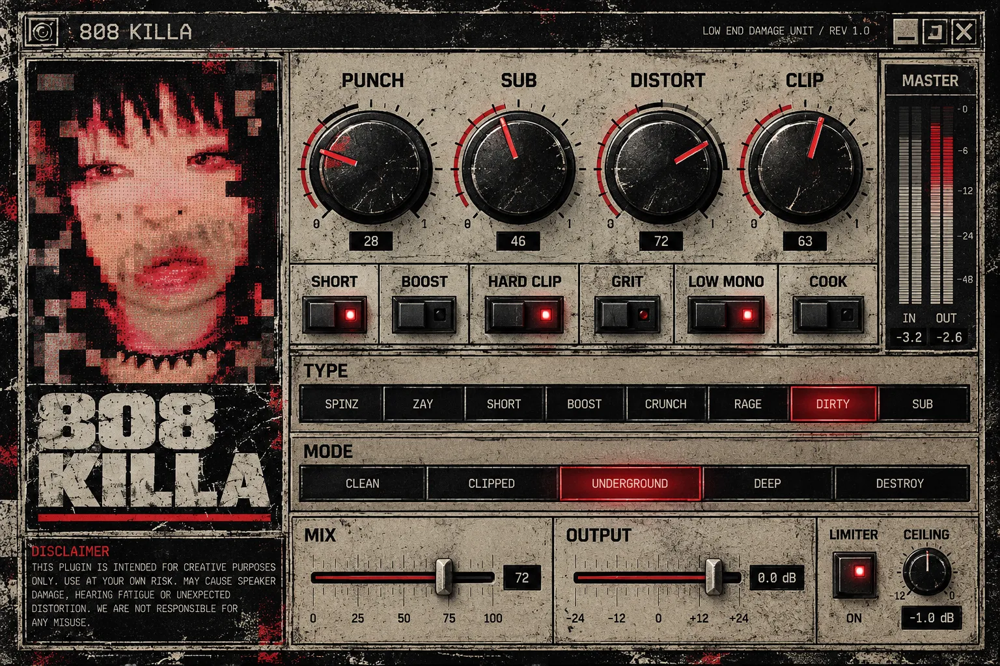

# 808 KILLA – Low End Damage Unit

Audio efekt pro 808 (VST3 pro Windows a Mac, AU pro Logic). Vložíš ho na mixer insert s 808,
vybereš styl, otočíš KILL a pár maker – hotovo. Plugin nemá sampler, zpracovává jen audio, které do něj přijde.

## Stažení hotového pluginu

GitHub ho sestaví sám po každé změně:

1. Záložka **Actions** → poslední běh **Build 808 KILLA** se zelenou fajfkou.
2. Dole v **Artifacts** stáhni:
   - **808-KILLA-Installer-Windows** – instalátor (.exe), nainstaluje VST3 do `C:\Program Files\Common Files\VST3`
   - nebo **808-KILLA-VST3-Windows** – samotná složka `808 KILLA.vst3` na ruční zkopírování
   - **808-KILLA-Installer-macOS** – instalátor (.pkg) pro Mac (VST3 + AU)
3. Ve FL Studiu: *Options → Manage plugins → Find more plugins*.

## Co umí (verze 0.7) – podle technického zadání

Řetězec (vše mezi vstupem a downsamplerem běží ve 4× oversamplingu, latence 4 vzorky):

`Input gain → Phase → LR4 crossover (80–200 Hz) → SUB: mono, 28 Hz HPF 24 dB/okt, sidechain ducking`
`→ MID/HIGH: Focus bell 550 Hz (0–12 dB), Drive, saturace Tape / Tube / Foldback → součet → soft clipper s kolenem`
`→ downsampling → Phone preview (400 Hz–3,5 kHz) → Output trim → hard limit −0,1 dBFS`

- **Vlevo (SUB / INPUT):** INPUT, XOVER, FOCUS, přepínače MONO, 28 HZ, PHASE, PHONE
- **Uprostřed:** čelist = **DRIVE**, v puse vlna (bílá = vstup, červená = výstup) a OUT / CLIP / DUCK hodnoty
- **Vpravo:** DUCK, RELEASE, CLIP (drive do clipperu 0–18 dB), KNEE (0,5–0,95), CEILING, OUTPUT
- **Dole:** presety (96 ve 12 kategoriích) a typ saturace TAPE / TUBE / FOLDBACK

**Sidechain ve FL Studiu:** na mixer tracku s kickem klikni pravým na šipku k tracku s 808 → *Sidechain to this track*.
Ducking pracuje jen na sub pásmu, střed a výšky zůstávají.

## Build na vlastním PC

Visual Studio 2022 nebo novější s *Desktop development with C++*.
Spusť `build.bat` z *Developer Command Prompt for VS*, nebo ve Visual Studiu *File → Open → Folder* a *Build All*.
Výsledek: `build\K808_artefacts\Release\VST3\808 KILLA.vst3`. Testy: `build\tests\K808Tests_artefacts\Release\K808Tests.exe`.

## Kontrola kvality (běží automaticky v GitHub Actions)

- unit testy DSP (`tests/Tests.cpp`): všechny presety na 44,1–192 kHz, žádné NaN, offline = realtime,
  bypass bez ztráty, ticho po zastavení, mono, sidechain, uložení stavu, 10 instancí, CPU
- **pluginval** strictness 10 (Windows + Mac), **auval** (Mac)

## Struktura

- `Source/DSP/` – zvukové jádro (Engine, filtry)
- `Source/Parameters.*` – parametry (ID se po vydání 1.0 nesmí měnit)
- `Source/Presets.*` – factory presety + uživatelské presety
- `Source/UI/`, `Source/PluginEditor.*` – grafika
- `installer/` – instalátory (Inno Setup, pkg) a EULA
- `tools/` – skripty, které z původního návrhu vyrobí pozadí a texturu knobů
